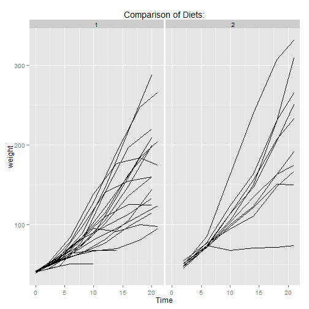

## Chick Weight App Overview

### What's in it for you? 

* Are you looking to raise your own chickens?

* Going organic?  Want to start a farm-to-table business?

* Well then, the Chick Weight App is the app for you

We did a detailed analysis of the available diets for raising chickens based on 
the following data set, ChickWeight. A synopsis of the dataset is available here

http://www.inside-r.org/r-doc/datasets/ChickWeight

--- 

## Data Set Details

Let's start by looking at an overall summary of the data set, and then take a 
look at the overview of the four diets:

```
##      weight           Time           Chick     Diet   
##  Min.   : 35.0   Min.   : 0.00   13     : 12   1:220  
##  1st Qu.: 63.0   1st Qu.: 4.00   9      : 12   2:120  
##  Median :103.0   Median :10.00   20     : 12   3:120  
##  Mean   :121.8   Mean   :10.72   10     : 12   4:118  
##  3rd Qu.:163.8   3rd Qu.:16.00   17     : 12          
##  Max.   :373.0   Max.   :21.00   19     : 12          
##                                  (Other):506
```

```
##   Diet count aveStartWeight aveEndWeight avePerGrowth
## 1    1    20           41.0       157.95     283.8922
## 2    2    10           40.7       215.60     433.8726
## 3    3    10           40.8       271.90     564.8950
## 4    4    10           41.0       229.90     462.8298
```

---

## App Results
Sample, illustrative results shown below

 

---

## What are you waiting for, Download today

Our app intuitively allows you to view a side-by-side comparison of two diets, 
and hence if you start collecting your own dataset and or are able to get diet
datasets from others you'll be able to load and compare more diets

Visit us at  https://petersedivec.shinyapps.io/chickenWeight/
